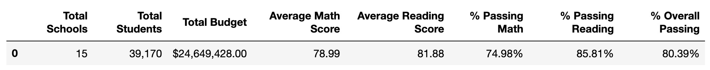
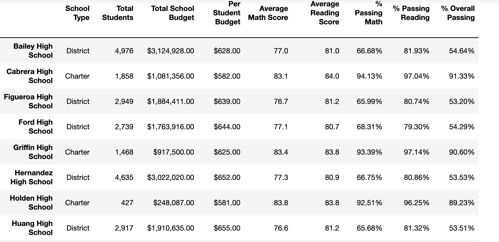
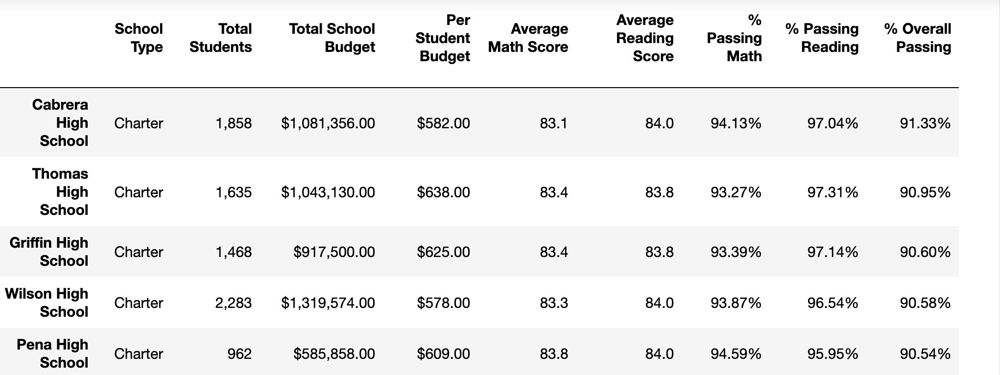
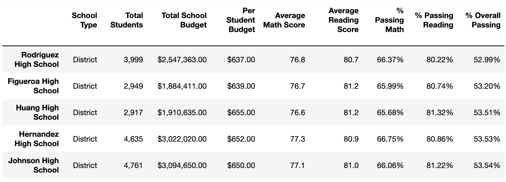

# 
Pandas, Pandas, Pandas!

## PyCity School

## Background

Onward to the education sector after years of analyzing financial records for big banks! The many years of analyzing data make you the ideal candidate as Chief Data Scientist for the school district. Pandas can help with making strategic decisions regarding future school budgets and priorities for the school board and mayor.

First task is to analyze the district-wide standardized test results for math and reading. We will showcase a few trends in school performance and provide a few results. 

## Trends

### Trend #1: 

From the 15 schools in the district, the students are passing reading at about 10% higher percentange rate than math. The latter likely note that kids would benefit from math assistance, or the school invest in opportunities that would improve math scores overall. 

### Trend #2: 
The data shows that spending per student has an inverse correlation to percent overall passing. Despite increased spending per student, the latter does not guarantee a better percent overall passing rate.

###District Summary

The District Summary provides a high-level overview, in a DataFrame, of the district's key metrics. You will find the following metrics and interpreted trends below:

* Total Schools
* Total Students
* Total Budget
* Avg Math Score
* Avg Reading Score
* % Passing Math
* % Passing Reading
* % Overall Passing

## School Summary

School Summary summarizes key metrics about each school. Review the trends from the data provided. We created a DataFrame that pulls in the following:

* School name
* School type
* Total students
* Total school budget
* Per student budget
* Average math score
* Average reading score
* % passing math (the percentage of students who passed math)
* % passing reading (the percentage of students who passed reading)
* % overall passing (the percentage of students who passed math AND reading)

## Highest Performing Schools (by % Overall Passing)

The highlighted top five performing school was based on perent overall passing rate using a DataFrame. You will find the following metrics:

* School name
* School type
* Total students
* Total school budget
* Per student budget
* Average math score
* Average reading score
* % passing math (the percentage of students who passed math)
* % passing reading (the percentage of students who passed reading)
* % overall passing (the percentage of students who passed math AND reading)

## Bottom Performing Schools (by % Overall Passing)

The bottom five performing schools was created using a DataFrame, as well. The table include the following:

* School name
* School type
* Total students
* Total school budget
* Per student budget
* Average math score
* Average reading score
* % passing math (the percentage of students who passed math)
* % passing reading (the percentage of students who passed reading)
* % overall passing (the percentage of students who passed math AND reading)

