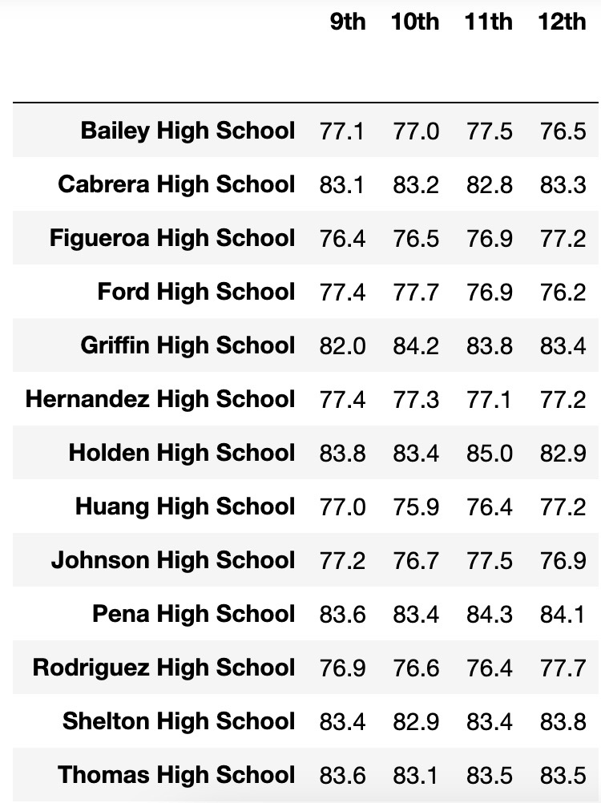
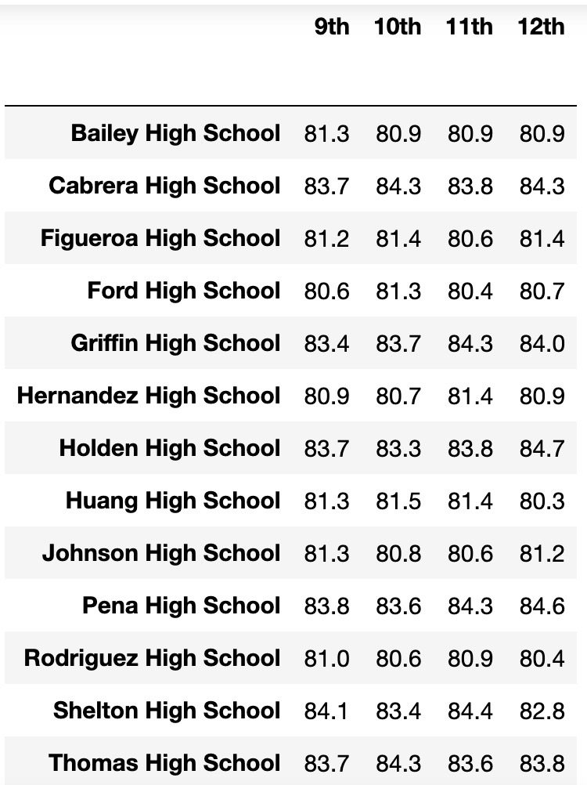
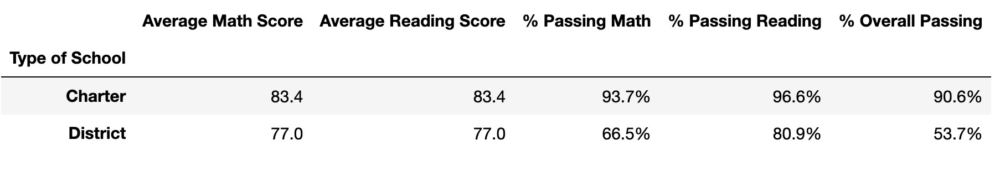

# 
Pandas, Pandas, Pandas!

## PyCity School

## Background

Onward to the education sector after years of analyzing financial records for big banks! The many years of analyzing data make you the ideal candidate as Chief Data Scientist for the school district. Pandas can help with making strategic decisions regarding future school budgets and priorities for the school board and mayor.

First task is to analyze the district-wide standardized test results for math and reading. We will showcase a few trends in school performance and provide a few results. 

## Trends

### Trend #1: 

From the 15 schools in the district, the students are passing reading at about 10% higher percentange rate than math. The latter likely note that kids would benefit from math assistance, or the school invest in opportunities that would improve math scores overall. 

### Trend #2: 
Charter schools have a higher percent overall passing rate than district schools. District school students low percent of passing math shows that more investment in math improvement is encouraged. 

### District Summary

The District Summary provides a high-level overview, in a DataFrame, of the district's key metrics. You will find the following metrics:

* Total Schools
* Total Students
* Total Budget
* Avg Math Score
* Avg Reading Score
* % Passing Math
* % Passing Reading
* % Overall Passing

## School Summary

School Summary summarizes key metrics about each school. Review the trends from the data provided. We created a DataFrame that pulls in the following:

* School name
* School type
* Total students
* Total school budget
* Per student budget
* Average math score
* Average reading score
* % passing math (the percentage of students who passed math)
* % passing reading (the percentage of students who passed reading)
* % overall passing (the percentage of students who passed math AND reading)

## Highest Performing Schools (by % Overall Passing)

The highlighted top five performing school was based on perent overall passing rate using a DataFrame. You will find the following metrics:

* School name
* School type
* Total students
* Total school budget
* Per student budget
* Average math score
* Average reading score
* % passing math (the percentage of students who passed math)
* % passing reading (the percentage of students who passed reading)
* % overall passing (the percentage of students who passed math AND reading)

## Bottom Performing Schools (by % Overall Passing)

The bottom five performing schools was created using a DataFrame, as well. The table include the following:

* School name
* School type
* Total students
* Total school budget
* Per student budget
* Average math score
* Average reading score
* % passing math (the percentage of students who passed math)
* % passing reading (the percentage of students who passed reading)
* % overall passing (the percentage of students who passed math AND reading)

## Math and Reading Scores by Grade

Did I say DataFrame, again? Yes, yes, and yes! For the following tables, a DataFrame was created to show the average math and reading score for students in grade ninth, tenth, eleventh, and twelfth grade at each school. See results below.

## Scores by School Spending, Size, and Type

Scores by school spending, size, and type are three separate table that breaks down school performance based on average spending ranges per student (budget bins), size of schools (small, medium, and large bins), and type of school (district or charter bins). Bin were created to highlight the latter. All tables included the follow:

* Average math score
* Average reading score
* % passing math (the percentage of students who passed math)
* % passing reading (the percentage of students who passed reading)
* % overall passing (the percentage of students who passed math AND reading

